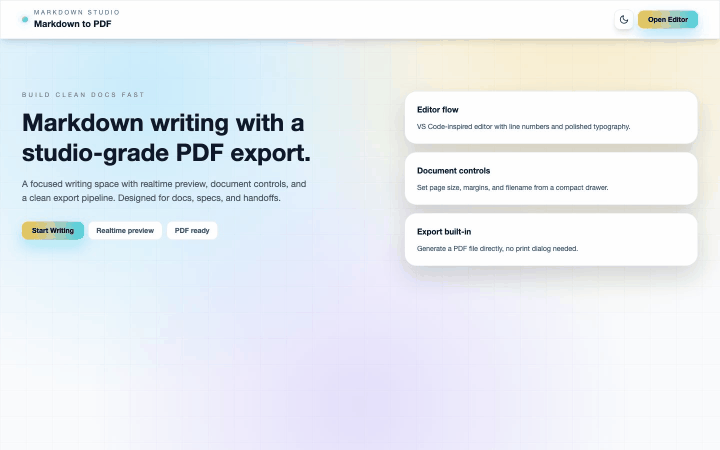

# Markdown to PDF




## Demo
  [Link](markdowntopdf-woad.vercel.app)
## Highlights

- Realtime Markdown preview with typography tuned for docs
- PDF export via a server action powered by Playwright
- Document settings: page size, margin, filename
- Local autosave with manual save/load snapshots
- Light/dark theming with a polished UI

## Architecture

Routes:
- `app/routes/home.tsx`: marketing landing page
- `app/routes/editor.tsx`: editor + preview UI
- `app/routes/export-pdf.tsx`: server action that renders Markdown to HTML and generates the PDF

State:
- `app/stores/editor-store.ts`: Zustand store with persistence to `localStorage`

Rendering:
- `app/components/markdown-renderer.tsx`: Markdown → HTML with `react-markdown` + `rehype-raw`
- `app/components/preview-panel.tsx`: in-app preview with configurable page sizing

PDF pipeline:
- Server action builds static HTML and uses Playwright Chromium to create the PDF

## Tech Stack

- React 19 + React Router 7 (full-stack runtime)
- Vite 7 build tooling
- TypeScript 5
- Tailwind CSS v4
- Zustand for editor state
- `react-markdown` + `rehype-raw` for rendering
- Playwright Chromium for PDF generation
- Biome for linting/formatting

## Getting Started

### Install

```bash
pnpm install
```

### Dev

```bash
pnpm dev
```

App runs at `http://localhost:5173`.

### Build

```bash
pnpm build
```

### Start (production)

```bash
pnpm start
```

## Key Scripts

- `pnpm dev`: start the dev server
- `pnpm build`: build for production
- `pnpm start`: run the production server
- `pnpm typecheck`: typegen + TypeScript
- `pnpm check`: Biome checks
- `pnpm test:e2e`: Playwright end-to-end tests

## Deployment Notes

- The PDF export uses Playwright in the server runtime. Ensure the deployment environment supports Chromium (or install the required browsers) and allows sandboxing flags used in `app/routes/export-pdf.tsx`.
- For containerized deploys, include Playwright dependencies or use a base image that already provides them.
- Vercel: set `PLAYWRIGHT_SKIP_BROWSER_DOWNLOAD=1` since the export route uses `@sparticuz/chromium` + `playwright-core` in production.

## Project Layout

```
app/
  components/
  routes/
  stores/
  root.tsx
public/
tests/
```

## Contributing

This is a personal portfolio project, but feedback and suggestions are welcome! Feel free to:

- Open issues for bugs or feature requests
- Submit PRs for improvements
- Share feedback on the architecture or design

## License

This project is open source and available under the MIT License.
